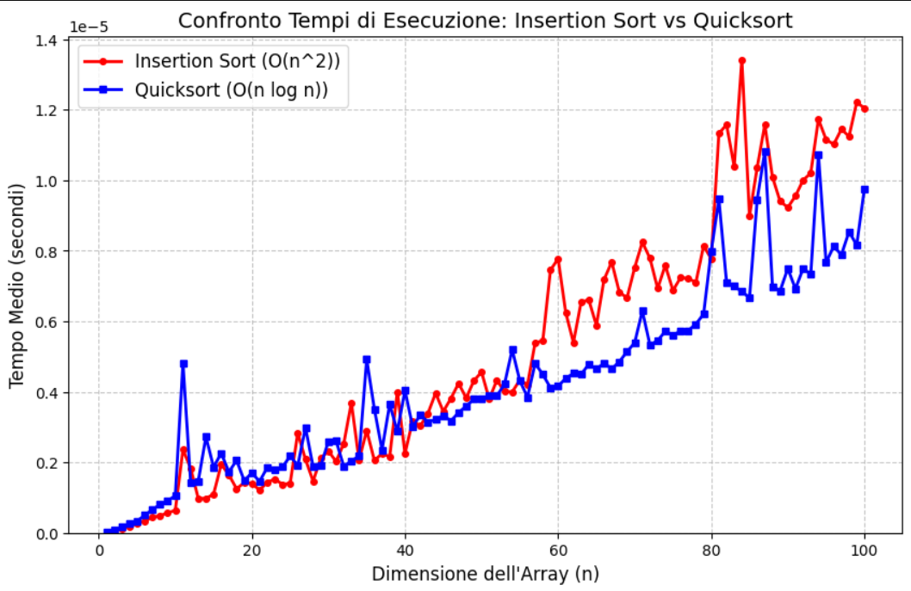
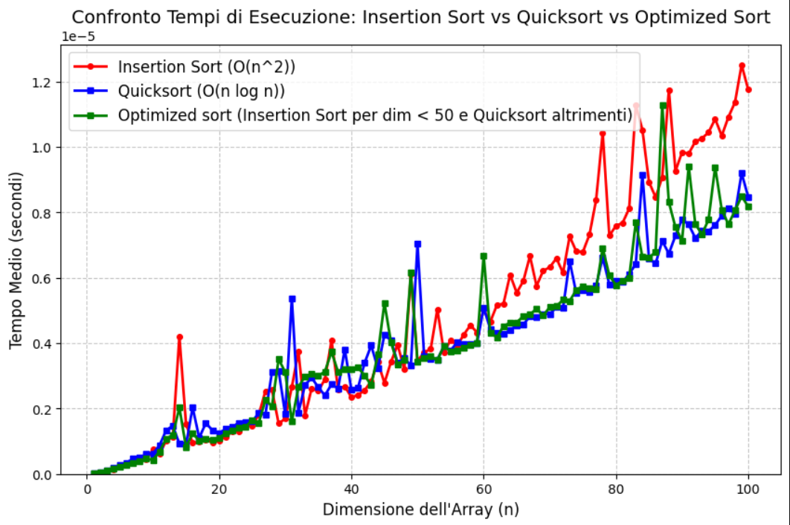
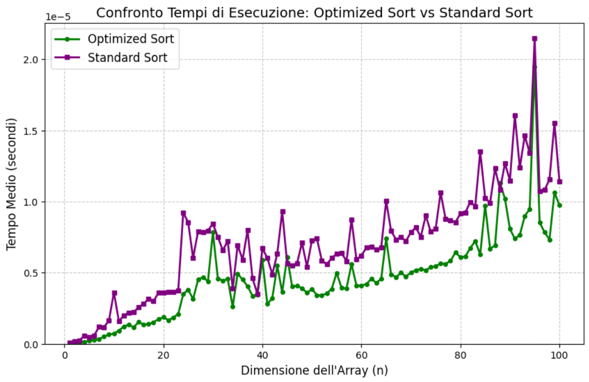
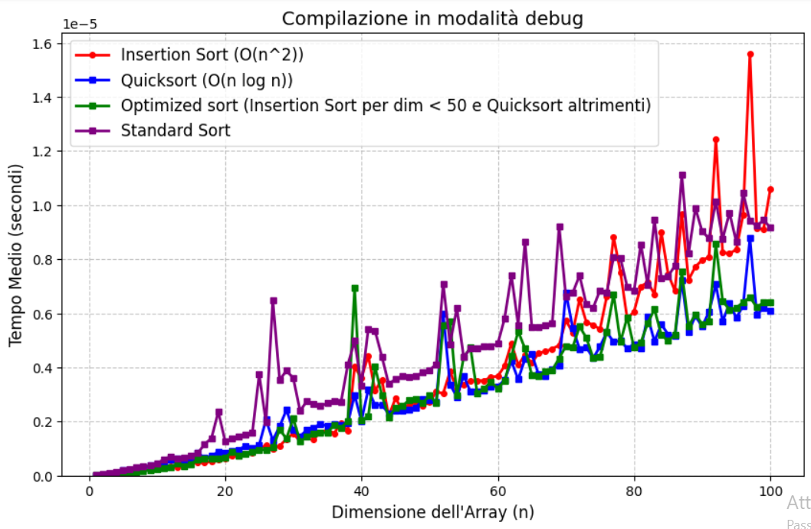
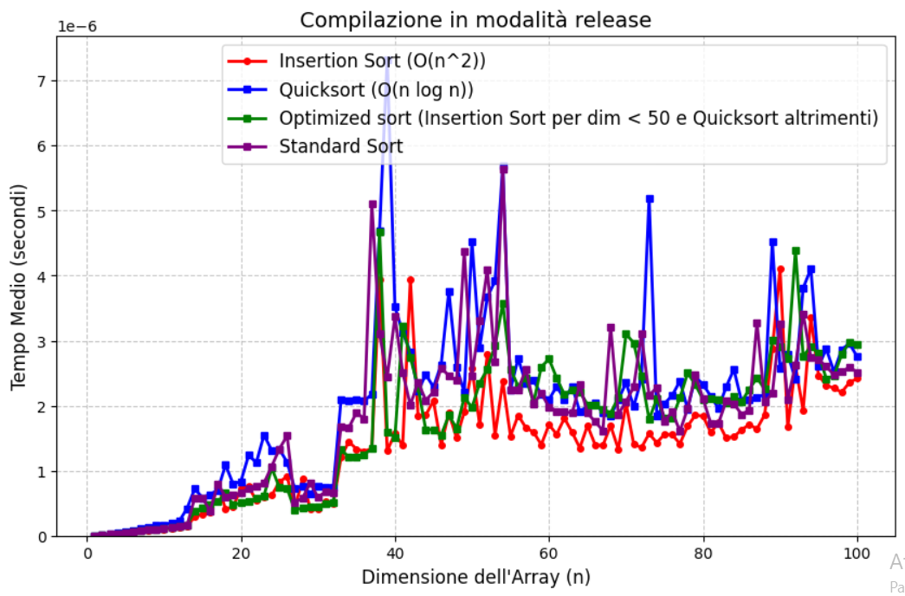

GRAFICI E OSSERVAZIONI
1. Nel primo grafico ho confrontato le velocità degli algoritmi Insertion Sort (algoritmo quadratico più veloce) e Quicksort (algoritmo logaritmico più veloce). Dalla figura si nota che Insertion Sort è più veloce a ordinare i vettori di dimensioni più piccole (1 < n < 40/50), mentre per i vettori di dimensioni più grandi funziona meglio Quicksort (n > 50/60). 

2. Il secondo grafico analizza l'Optimized Sort, una versione modificata del Quicksort che sfrutta l'Insertion Sort per i vettori con dimensione inferiore a 50. La curva verde dimostra come questo approccio ibrido unisca con successo i vantaggi di entrambi i metodi: ricalca la rapidità dell'Insertion Sort (curva rossa) per n < 50 e l'efficienza del Quicksort (curva blu) per n > 50. Di conseguenza, risulta mediamente l'algoritmo più performante sull'intero spettro analizzato.

3. Nel terzo grafico ho messo a confronto l'efficienza della versione modificata del Quicksort con quella dell'algoritmo std::sort dalla libreria standard. L'algoritmo ottimizzato è il più performante.

4. In questi due ultimi grafici notiamo come gli algoritmi in modalità Release sono più veloci rispetto a quando il codice viene compilato in modalità Debug.

